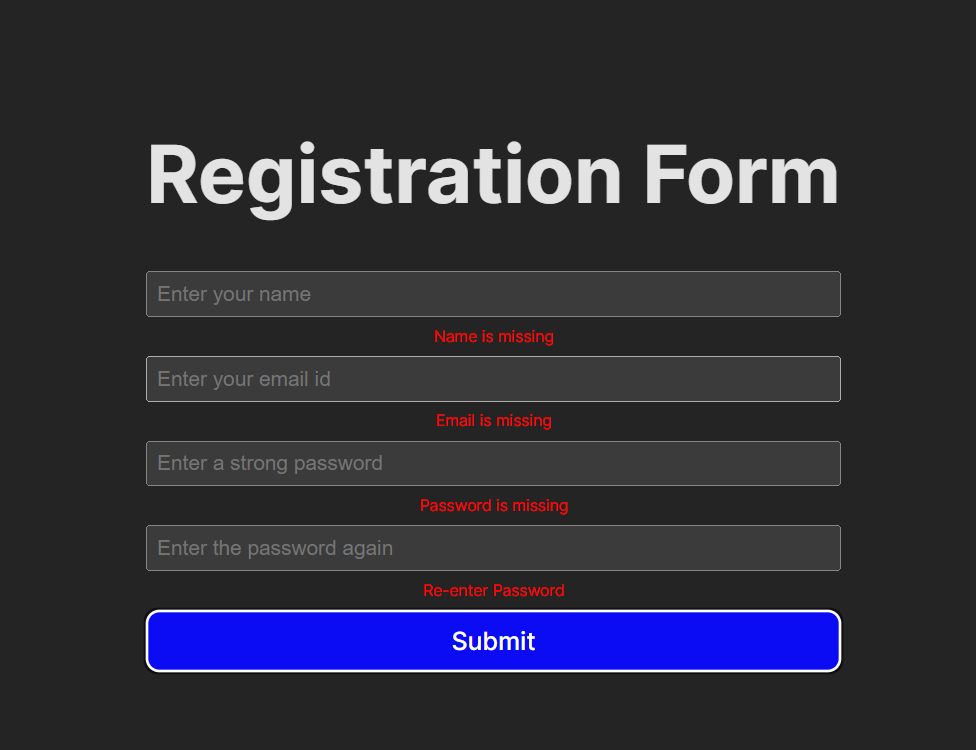
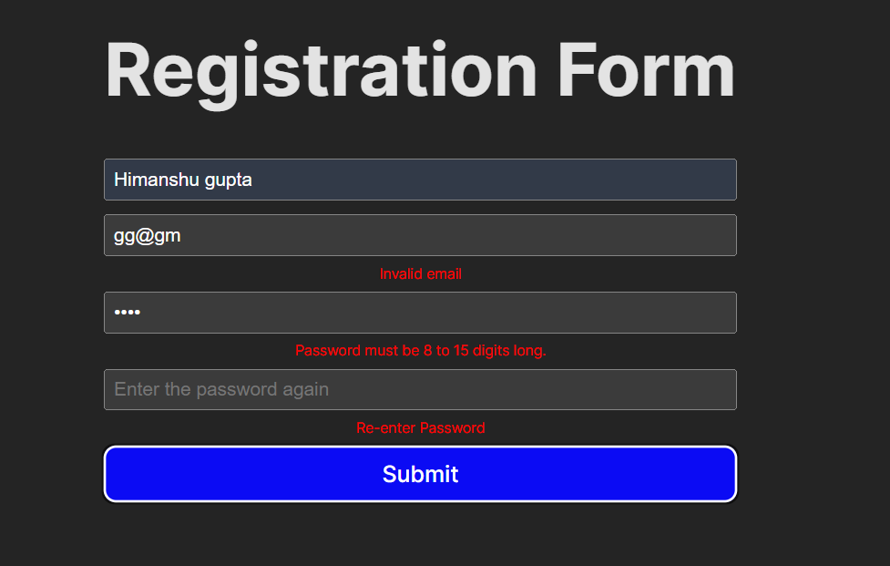

  ##Form Validation

  Topic: Form Handling, Validation

  Requirements:
    Create a registration form with name, email, password, and confirm password fields.
    Implement validation for each field.
    Display error messages for invalid input.

